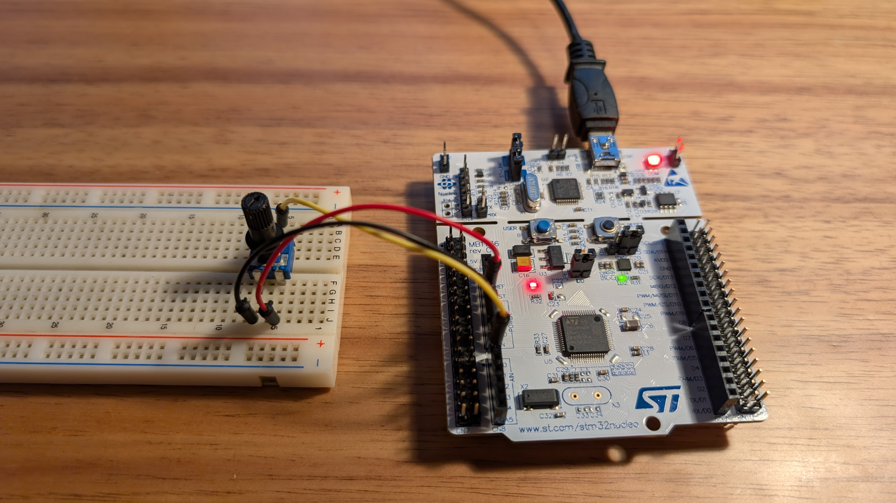
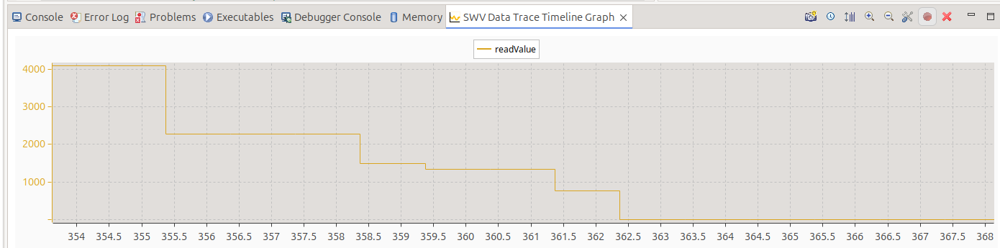

# ADC Potentiometer

### Description
The goal of this project is to explore the ADC input functionality. A potentiometer is connected to an ADC input, and the green LED brightness changes according to the potentiometer value using PWM.
This project is done using the STM32CubeIDE and a STM32 Nucleo board.

### Hardware
- **Board:** Nucleo-F446RE
- **MCU:** STM32F446R
- **Components used:** Potentiometer; onboard Green LED (LD2)

### Setup

### Tools & Environment
- **IDE:** STM32CubeIDE 1.19.0
- **Firmware Package:** STM32CubeF4 v1.28.3 
- **Language:** C
- **HAL Drivers:** Yes

### Project Structure
adc_potentiometer/

├── Core/

│ ├── Inc/ → Header files

│ └── Src/ → Source files 

├── Drivers/ → HAL and CMSIS drivers 

├── adc_potentiometer.ioc → STM32CubeIDE configuration 

├── README.md → Project description 

### How It Works
1. An external potentiometer is connected to the Nucleo board - A0 input (plus 3.3V and GND)
2. The ADC channel 1, IN0 is enabled as continuous conversion mode
3. In a continuous loop, the ADC converts the input signal from potentiometer and the green LED PWM is adjusted accordinlgy
  
  
### Main functions:
- **HAL_ADC_Start ()** – enables ADC and starts conversion of the regular channels
- **HAL_ADC_PollForConversion()** - start the conversion in the selected channel and keep waiting till the conversion is done
- **HAL_ADC_GetValue()** - gets the converted value from data register of regular channel
- **HAL_ADC_Stop()** – disables ADC and stop conversion of regular channels 
- **__HAL_TIM_SET_COMPARE()** – sets the PWM for the LED

  
## Build and Flash

To compile and flash using STM32CubeIDE:
1. Open the project folder (`pwm_led`) in STM32CubeIDE.
2. Build (`Ctrl + B`).
3. Flash the firmware (`Run` → `Run As` → `STM32 Cortex-M C/C++ Application`).

### Demo
ADC reading with ATM32CubeIDE SWV Data Trace

Real demo

