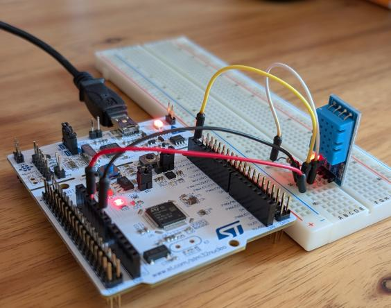
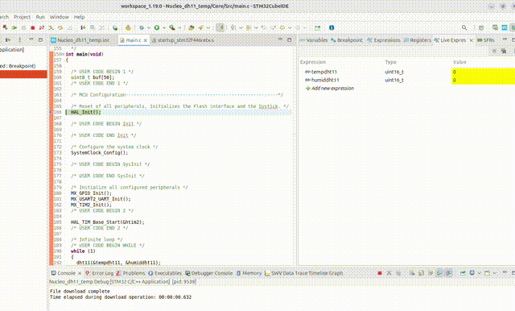

# DHT11 Sensor Reading

### Description
This project demonstrates how to interface the **DHT11 temperature and humidity** sensor with the STM32 Nucleo board. The microcontroller reads the sensor data using a **single-wire** protocol and sends the temperature and humidity values over **UART** to the PC.

This project is done using the STM32CubeIDE and **without the DHT11 libraries** - only time anlysis.

### Hardware
- **Board:** Nucleo-F446RE
- **MCU:** STM32F446R
- **Components used:** DHT11 sensor; onboard Green LED (LD2)

### Credits
The sensor reading without librareis is done according with the explanation 

### HW Setup

| Component        | Connection           | Description                              |
| ---------------- | -------------------- | ---------------------------------------- |
| DHT11 Sensor     | PB9                  | Single-wire data interface               |
| DHT11 Sensor     | 3.3V                 | Power supply                             |
| DHT11 Sensor     | GND                  | Ground                                   |
| Pull-up resistor (1k) | Between PB9 and 3.3V | Ensures proper single-wire communication |

### Tools & Environment
- **IDE:** STM32CubeIDE 1.19.0
- **Firmware Package:** STM32CubeF4 v1.28.3 
- **Language:** C
- **HAL Drivers:** Yes
- **Interfaces:** single-wire, UART

### Project Structure
dht11_sensor/

├── Core/

│ ├── Inc/ → Header files

│ └── Src/ → Source files 

├── Drivers/ → HAL and CMSIS drivers 

├── dht11_sensor.ioc → STM32CubeIDE configuration 

├── README.md → Project description 

### How It Works
1. The DHT11 sensor is connected to the STM32 Nucleo board using a single-wire interface on **GPIO PB9**. Power (3.3 V and GND) is provided by the Nucleo board, and a pull-up resistor is added to the data line.
2. The **system clock** is configured to 90 MHz, and **TIM2** is configured with an **internal clock source** and a **prescaler of 90**, resulting in a timer tick of **1 µs** (1 / (90 MHz / 90)) for precise signal timing.
3. Two global variables are defined to store the sensor readings — temperature and humidity. 
4. The function ***void dht11(uint16_t *temp, uint16_t *humid)*** handles the single-wire communication protocol. It controls the GPIO line and uses TIM2 for timing, following the DHT11 datasheet sequence to read temperature and humidity values.
5. Inside the main loop, the MCU continuously reads the sensor data by calling the dht11() function and sends the results **over UART** to the PC for monitoring.
  
  
### Main functions:
- **HAL_ADC_Start ()** – enables ADC and starts conversion of the regular channels
- **HAL_ADC_PollForConversion()** - start the conversion in the selected channel and keep waiting till the conversion is done
- **HAL_ADC_GetValue()** - gets the converted value from data register of regular channel
- **HAL_ADC_Stop()** – disables ADC and stop conversion of regular channels 
- **__HAL_TIM_SET_COMPARE()** – sets the PWM for the LED

  
## Build and Flash

To compile and flash using STM32CubeIDE:
1. Open the project folder (`dht11_sensor`) in STM32CubeIDE.
2. Build (`Ctrl + B`).
3. Flash the firmware (`Run` → `Run As` → `STM32 Cortex-M C/C++ Application`).

### Demo

