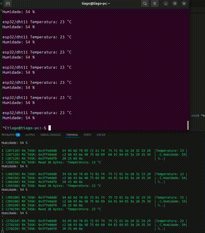

# DHT11 Sensor Reading and Publish to MQTT Broker

### Description
This project builds a simple IoT sensor-to-cloud pipeline using two microcontrollers:
- The STM32 Nucleo-F446RE reads temperature and humidity data from a DHT11 sensor using a single-wire protocol and sends it over UART
- The ESP32-S2 receives the readings over UART, connects to a Wi-Fi network, and publishes them to an MQTT broker (the test.mosquitto.org)

This project is done using the STM32CubeIDE and Visual Studio Code with ESP-IDF extension.

### Hardware
- **Boards:**
  - Nucleo-F446RE
  - ESP32-S2-Saola
- **Components used:** DHT11 sensor
- **Interfaces:** Single-wire; UART; WiFi; MQTT

### Credits
The sensor reading without librareis is done according with the explanation  & ESP32 MQTT & UART examples from ESP-IDF

### System Overview

| Component        | Role             | Description                                                   |
| ---------------- | ---------------- | ------------------------------------------------------------- |
| **DHT11 Sensor** | Input            | Measures temperature and humidity                             |
| **STM32 Nucleo** | Data acquisition | Reads DHT11 and sends formatted values over UART              |
| **ESP32-S2**     | Gateway          | Receives UART data, connects to Wi-Fi, and publishes via MQTT |
| **MQTT Broker**  | Cloud interface  | Receives and distributes sensor data to subscribers           |

### HW Setup

| Connection   | STM32 (Nucleo-F446RE) | ESP32-S3    | Description                                      |
| ------------ | --------------------- | ----------- | ------------------------------------------------ |
| UART TX      | PA2                   | GPIO18 (RX) | Sends sensor data to ESP32                       |
| UART RX      | PA3                   | GPIO17 (TX) | (Optional) bidirectional communication           |
| GND          | GND                   | GND         | Common ground                                    |
| DHT11 Data   | PB9                   | —           | Single-wire interface                            |
| DHT11 VCC    | 3.3V                  | —           | Power supply                                     |
| DHT11 GND    | GND                   | —           | Ground                                           |
| Pull-up (1k) | Between PB9 and 3.3V  | —           | Required for single-wire communication stability |

### Tools & Environment
- **IDE:** STM32CubeIDE 1.19.0 & Visual Studio Code (ESP-IDF Extension)
- **Firmware Package:** STM32CubeF4 v1.28.3 & ESP-IDF v6.0.0
- **Language:** C
- **HAL Drivers:** Yes
- **Interfaces:** Single-wire; UART; WiFi; MQTT

### Project Structure
dht11_uart_mqtt/

├── stm32_nucleo/  

│   ├── Core/ 

│   ├── Drivers/ 

│   ├── dht11.c

│   ├── main.c

│   └── ...

│
├── esp32_s3/

│   ├── main/

│   │   ├── app_main.c

│   │   ├── CMakeLists.txt

│   │   ├── Kconfig.projbuild

│   │   └── ...

│   ├── sdkconfig.defaults

│   └── ...

└── README.md  ← This file

### How It Works
1. The STM32 Nucleo reads temperature and humidity from the DHT11 sensor and sends the formatted data over UART
2. The ESP32-S2 receives the sensor data through UART, connects to a Wi-Fi network (SSID and password set in menuconfig), and publishes the received data to an MQTT broker under the topic esp32/dht11
3. Data is monitored using the MQTT client with command *mosquitto_sub -h test.mosquitto.org -t "esp32/dht11" -v*
4. The function ***void dht11(uint16_t *temp, uint16_t *humid)*** handles the single-wire communication protocol. It controls the GPIO line and uses TIM2 for timing, following the DHT11 datasheet sequence to read temperature and humidity values.

  
## Build and Flash

To compile STM32 **Nucleo-F446RE**:
1. Open the project folder (`stm32_nucleo`) in STM32CubeIDE.
2. Build (`Ctrl + B`).
3. Flash the firmware (`Run` → `Run As` → `STM32 Cortex-M C/C++ Application`).

To compile **ESP32-S2**:
1. Open the esp32_s2/ project in Visual Studio Code.
2. Configure WiFi credentials using menuconfig
3. Build, flash and monito (idf.py build flash monitor)

### Demo

