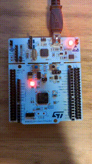

# GPIO Input Button

### Description
The goal of this project is to turn-on the onboard green LED when the onboard user button is pressed.
This project is done using the STM32CubeIDE and a STM32 Nucleo board.

### Hardware
- **Board:** Nucleo-F446RE
- **MCU:** STM32F446R
- **Onboard components used:** Blue User button; Green LED (LD2)

### Tools & Environment
- **IDE:** STM32CubeIDE 1.19.0
- **Firmware Package:** STM32CubeF4 v1.28.3 
- **Language:** C
- **HAL Drivers:** Yes

### Project Structure
pwm_led/

├── Core/

│ ├── Inc/ → Header files

│ └── Src/ → Source files 

├── Drivers/ → HAL and CMSIS drivers 

├── gpio_input_button.ioc → STM32CubeIDE configuration 

├── README.md → Project description 

### How It Works
1. The GPIO connected to the user blue button (PC13) is configured as Input pin
2. The GPIO pin connected to the green LED (LD2) is configured as output
3. The program continuously reads the input GPIO from the button and turns on the LED when the button is pressed  
  
### Main functions:
- **HAL_GPIO_ReadPin()** – Reads the input pin.
- **HAL_GPIO_WritePin()** – Sets the GPIO output state

## Build and Flash

To compile and flash using STM32CubeIDE:
1. Open the project folder (`pwm_led`) in STM32CubeIDE.
2. Build (`Ctrl + B`).
3. Flash the firmware (`Run` → `Run As` → `STM32 Cortex-M C/C++ Application`).

### Demo

