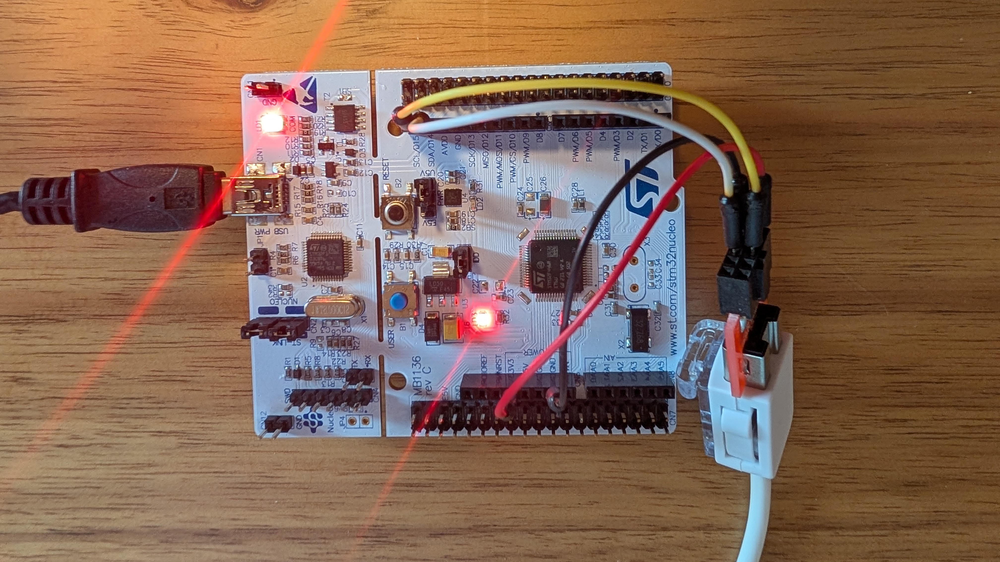
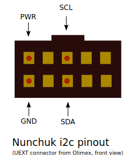

# Nunchuk I2C

### Description
This project demonstrates how to interface a **Nunchuk** joystick with a STM32 Nucleo board via **I2C**. The Nunchuk buttons and joystick positions are read continuously, sent to a **PC via UART**, and used to **control the onboard green LED (LD2) based on the C and Z buttons**.

This project is done using the STM32CubeIDE.

### Hardware
- **Board:** Nucleo-F446RE
- **MCU:** STM32F446R
- **Components used:** Nunchuk joystick white; onboard Green LED (LD2)

### HW Setup

| Component        | Connection           | Description                              |
| ---------------- | -------------------- | ---------------------------------------- |
| Nunchuk PWR      | 3.3V                 | Power supply               |
| Nunchuk GND     | GND                 | Ground                             |
| Nunchuk SCL     | SCL/D15                  | I2C clock - SCL/D15 is connected to MCU PB8 |
| Nunchuk SDA     | SDA/D14                  | I2C clock - SDA/D14 is connected to MCU PB9 |

### Tools & Environment
- **IDE:** STM32CubeIDE 1.19.0
- **Firmware Package:** STM32CubeF4 v1.28.3 
- **Language:** C
- **HAL Drivers:** Yes
- **Interfaces:** I2C, UART

### Project Structure
i2c_nunchuk/

├── Core/

│ ├── Inc/ → Header files

│ └── Src/ → Source files 

├── Drivers/ → HAL and CMSIS drivers 

├── i2c_nunchuk.ioc → STM32CubeIDE configuration 

├── README.md → Project description 

### How It Works
1. The Nunchuk is connected to the Nucleo board via I2C (PB8=SCL, PB9=SDA).
2. The i2c_nunchuk.c and i2c_nunchuk.h files provide functions to initialize the Nunchuk and read joystick/buttons data.
3. In the main loop:
   * Nunchuk data is read continuously using Nunchuk_ReadData().
   * The data is formatted and sent via UART to a PC.
   * The green LED (LD2) is controlled based on the button states:
      * Both buttons released --> LED off
      * One button pressed --> LED blinks slowly
      * Both buttons pressed --> LED blinks fast
  
  
### Main functions:
- **Nunchuk_Init()** - initializes the Nunchuk over I2C
- **Nunchuk_ReadData()** - reads Nunchuk joystick data
- **HHAL_UART_Transmit()** - sends formatted Nunchuk data to a PC
- **H__HAL_TIM_SET_COMPARE() / __HAL_TIM_SET_AUTORELOAD()** - controls PWM output for the green LED 

  
## Build and Flash

To compile and flash using STM32CubeIDE:
1. Open the project folder (`dht11_sensor`) in STM32CubeIDE.
2. Build (`Ctrl + B`).
3. Flash the firmware (`Run` → `Run As` → `STM32 Cortex-M C/C++ Application`).

### Demo

