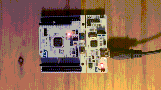

# Interrupt Button

### Description
The goal of this project is to use the onboard blue button as an external interrupt and toggle the green LED on/off when the button is pressed.  
This project is done using the STM32CubeIDE and a STM32 Nucleo board.

### Hardware
- **Board:** Nucleo-F446RE
- **MCU:** STM32F446R
- **Onboard components used:** Blue User button; Green LED (LD2)

### Tools & Environment
- **IDE:** STM32CubeIDE 1.19.0
- **Firmware Package:** STM32CubeF4 v1.28.3 
- **Language:** C
- **HAL Drivers:** Yes

### Project Structure
interrupt_button/

├── Core/

│ ├── Inc/ → Header files

│ └── Src/ → Source files 

├── Drivers/ → HAL and CMSIS drivers 

├── interrupt_button.ioc → STM32CubeIDE configuration 

├── README.md → Project description 

### How It Works
1. The GPIO connected to the user blue button (PC13) is configured as Interrupt
2. The GPIO pin connected to the green LED (LD2) is configured as output
3. By enablabling "EXTI line[15:10] interrupts" in NVIC and "Generate IRQ handler" and the "Call HAL" in "Code Generation", the function EXTI15_10_IRQHandler() calling the HAL_GPIO_EXTI_IRQHandler() is automatic created
4. The HAL_GPIO_EXTI_Callback(GPIO_Pin) function define the actions for the interrupt - set the LED on/of according to the interrupt button. The function is added in gpio.c 
  
  
### Main functions:
- **EXTI15_10_IRQHandler()** – IRQ handler
- **HAL_GPIO_EXTI_IRQHandler()** - Calls HAL IRQHandler
- **HAL_GPIO_EXTI_Callback()** - defines the interrupt actions
- **HAL_GPIO_WritePin()** – Sets the GPIO output state

## Build and Flash

To compile and flash using STM32CubeIDE:
1. Open the project folder (`pwm_led`) in STM32CubeIDE.
2. Build (`Ctrl + B`).
3. Flash the firmware (`Run` → `Run As` → `STM32 Cortex-M C/C++ Application`).

### Demo

