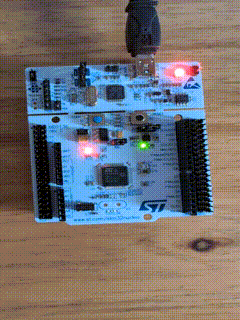

# Blink LED

### Description
The goal of this project is to control the brightness of the onboard green LED using **PWM**.
This project is done using the STM32CubeIDE and a STM32 Nucleo board.

### Hardware
- **Board:** Nucleo-F446RE
- **MCU:** STM32F446R
- **Onboard components used:** Green LED (LD2)

### Tools & Environment
- **IDE:** STM32CubeIDE 1.19.0
- **Firmware Package:** STM32CubeF4 v1.28.3 
- **Language:** C
- **HAL Drivers:** Yes

### Project Structure
pwm_led/

├── Core/

│ ├── Inc/ → Header files

│ └── Src/ → Source files 

├── Drivers/ → HAL and CMSIS drivers 

├── pwm_led.ioc → STM32CubeIDE configuration 

├── README.md → Project description 

### How It Works
The project initializes a **PWM output** on the GPIO connected to the onboard green LED (LD2), using TIM2.
By changing the **duty-cycle**, the LED brightness varies smoothly.

### Main functions:
- **MX_TIM2_Init()** – Configures the PWM timer TIM2.
- **HAL_TIM_PWM_Start()** – Starts the PWM signal.
- **__HAL_TIM_SET_COMPARE()** - updates the duty-cycle in a loop to fade the LED in and out

## Build and Flash

To compile and flash using STM32CubeIDE:
1. Open the project folder (`pwm_led`) in STM32CubeIDE.
2. Build (`Ctrl + B`).
3. Flash the firmware (`Run` → `Run As` → `STM32 Cortex-M C/C++ Application`).

### Demo

